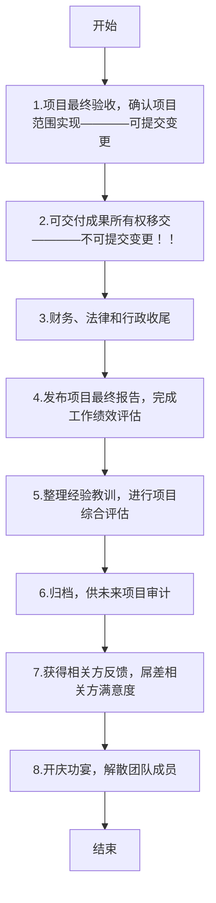

# 4.7 结束项目或阶段

收尾流程：

1. ### 输入

   1. #### 项目章程

   2. #### 项目管理计划

   3. #### 项目文件

   4. #### 验收的可交付成果

   5. #### 商业文件

   6. #### 协议

   7. #### 采购文档

      出现采购，项目经理一定是甲方

   8. #### 组织过程资产

2. ### 工具与技术

   1. #### 专家判断

   2. #### 数据分析

      1. 文件分析
      2. 回归分析
      3. 趋势分析
      4. 偏差分析

   3. #### 会议

3. ### 输出

   1. #### 最终产品、服务或成果移交

      验收不在收尾，例如：一个项目分为10个可交付成功，在完成一个之后进行验收

   2. #### 最终报告

   3. #### 项目文件（更新）

      1. 经验教训登记册

   4. #### 组织过程资产（更新）